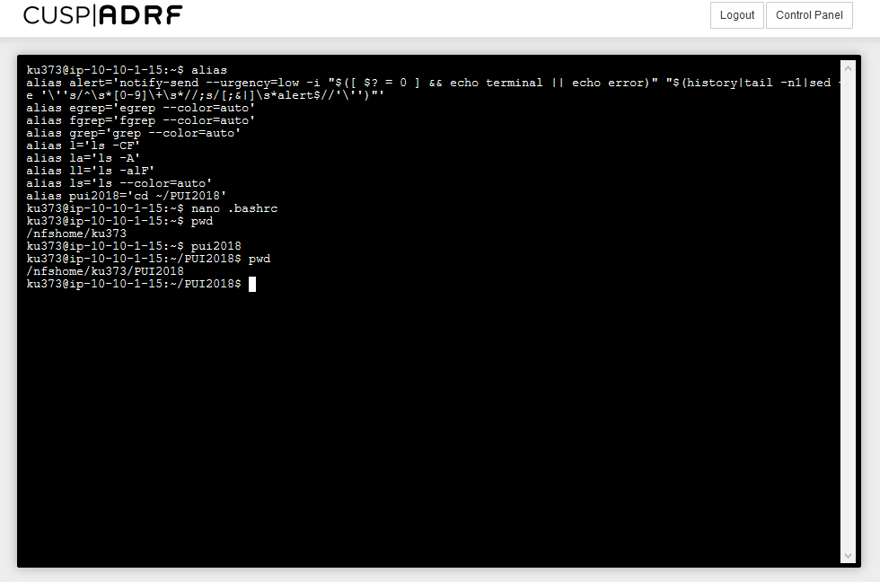

# PUI2018_ku373

## Questions and Tasks
HW2 is devided into two parts. 
- (HW2-HW1)Finish up environment settings and make pull request with other student 
- (HW2-HW2)Create a new repository called PUI2018_your NYU ID
 - Create a new repository
 - Create a Readme.md file
 - Connect a local repository with a remote repository

## Contributions
HW2 has been done by Kenji Uchimoto alone. In HW1, Kenji Uchimoto paired up with Wei-Yun Wang.

## Acknowledgements
TA helped me to understand the contents of HW.  
