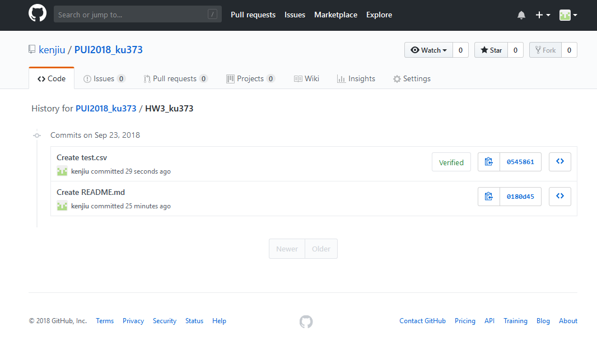
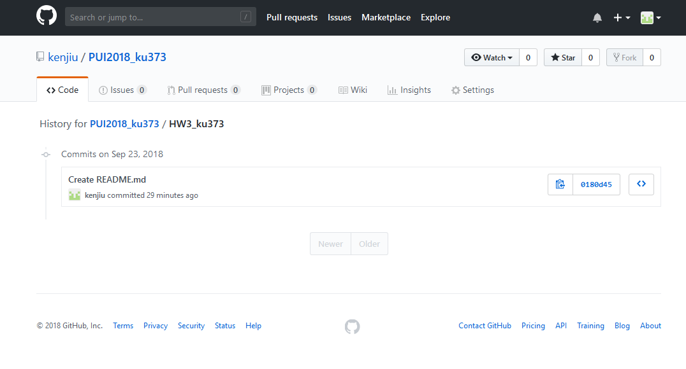

# HW3

## Questions and Tasks
HW3 is devided into four parts. 
- Create and delete files and thier histories
- Read open data and change it
- Read API and show the contents
- Get output and put it into CSV

## Contributions
HW3 has been done by Kenji Uchimoto alone.

## Acknowledgements
TA, Mr Fu helped me to understand the contents of HW.    
