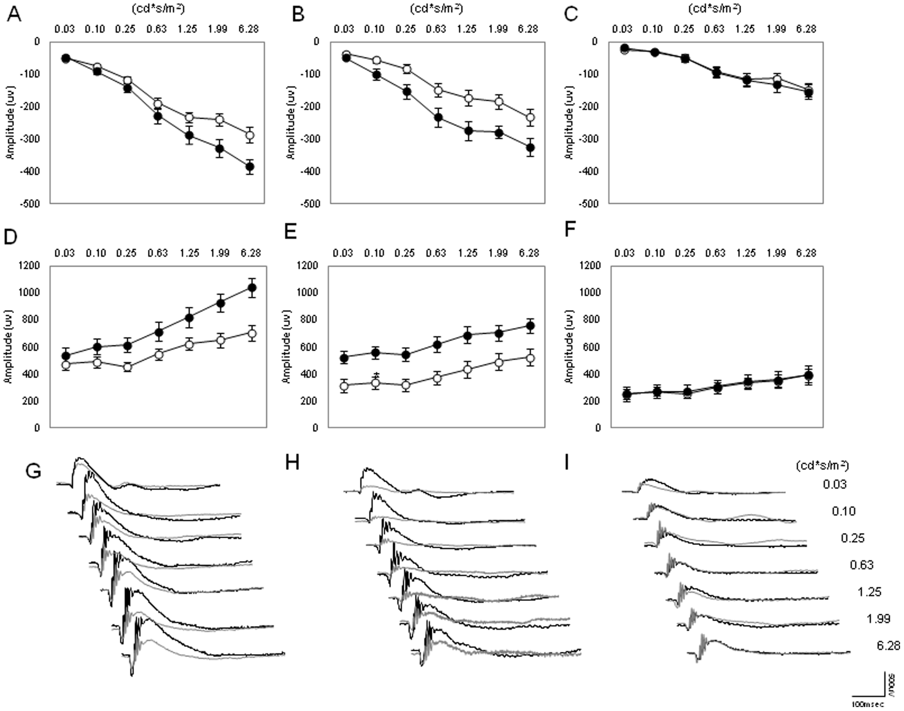
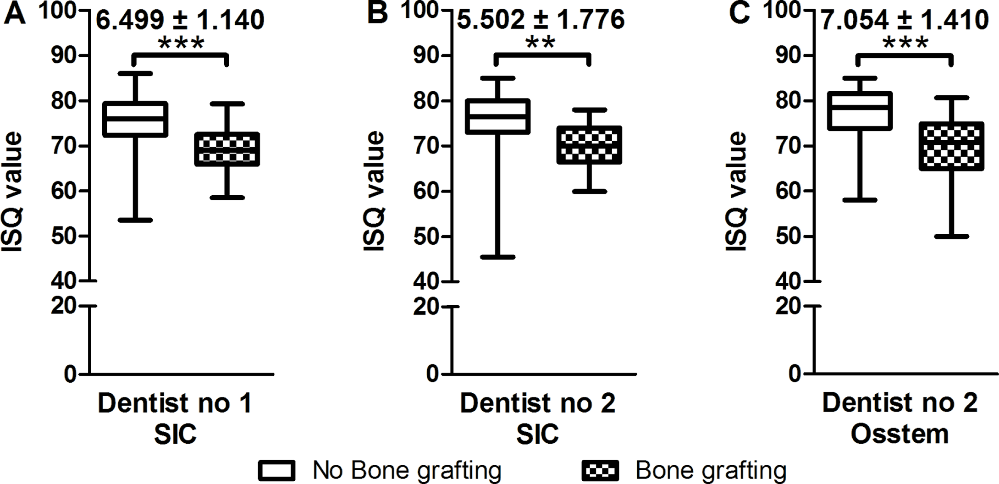
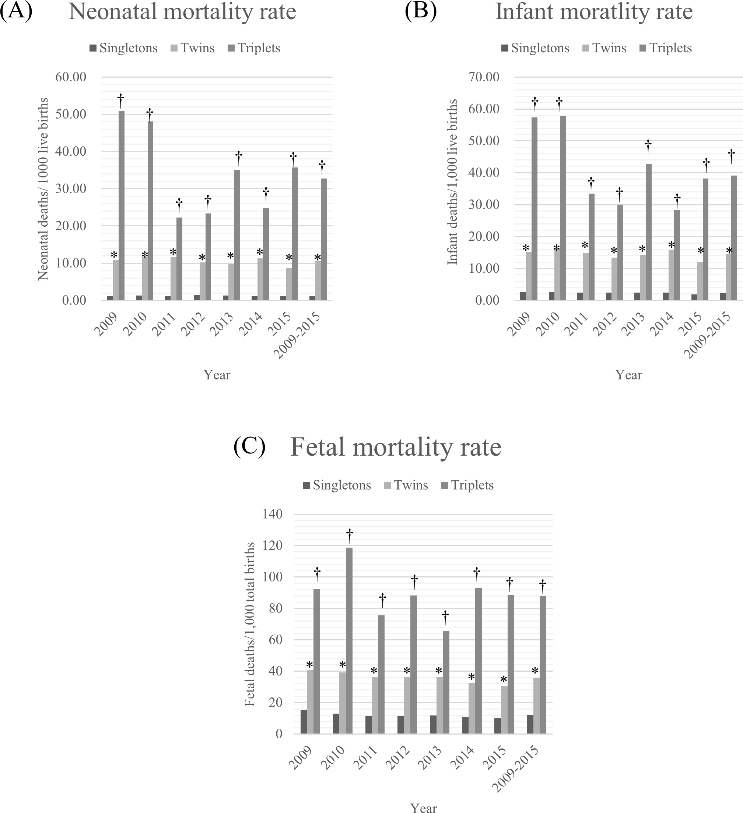

# HW5

## Questions and Tasks
HW5 is devided into three parts.

-Review
-Literatures of tests
-Reproduce tests
-Citibike and extra

## Contributions
HW5 has been done by Kenji Uchimoto alone. I reviewed the HW4 of Yusu(yq729).

## Acknowledgements
Mr. Sung helped me.

## Assignment 2

| **Statistical Analyses**	|  **IV(s)**  |  **IV type(s)** |  **DV(s)**  |  **DV type(s)**  |  **Control Var** | **Control Var type**  | **Question to be answered** | **_H0_** | **alpha** | **link to paper**| 
|:----------:|:----------|:------------|:-------------|:-------------|:------------|:------------- |:------------------|:----:|:-------:|:-------|
ANOVA | 3, Age groups | categorical | 1, Amplitude of waves | continuous | 0 | - | Are there any differences in amplitude of waves among different age groups of mice | Age3 = Age6 = Age12 in means of amplitude | 0.05 | [Age-Related Changes in the Daily Rhythm of Photoreceptor Functioning and Circuitry in a Melatonin-Proficient Mouse Strain](https://journals.plos.org/plosone/article?id=10.1371/journal.pone.0037799) |
Multiple regression	|	10, (X1) male = 1, female = 2; (X3) maxillary = 1, mandible = 2; (X4) immediate = 1, delayed = 2; (X5) bone grafting: no = 1, yes = 2, (X6) Implant diameter, (X7) Length (X8) I-stage = 2, II-stage = 1. (X9) Torque  (X10): type 1 = 100, type 2 = 010, type 3 = 001, and type 4 = 000 | categorical | 1, Implant stability quotient | continuous | 0 | - | Do variables influence implant stability quotient ? | coeffcients of X1, X2,X3,~ X11 = 0 | 0.05 | [Multivariate linear regression analysis to identify general factors for quantitative predictions of implant stability quotient values](https://journals.plos.org/plosone/article?id=10.1371/journal.pone.0187010) |
Logistic regression	|	3, Singleton, twin and triplet births	|	categorical	|	1, Probability of Mortality | dichotomous	|	0	|	-	|	Are there any differences in motality rate in different birth groups?	|	Singleton = twin = triplet in Prob of mortality	|	0.05	|	[Multiple birth rates of Korea and fetal/neonatal/infant mortality in multiple gestation](https://journals.plos.org/plosone/article?id=10.1371/journal.pone.0202318) |
|||||||||

## Anova

## Multiple

## Logistic

